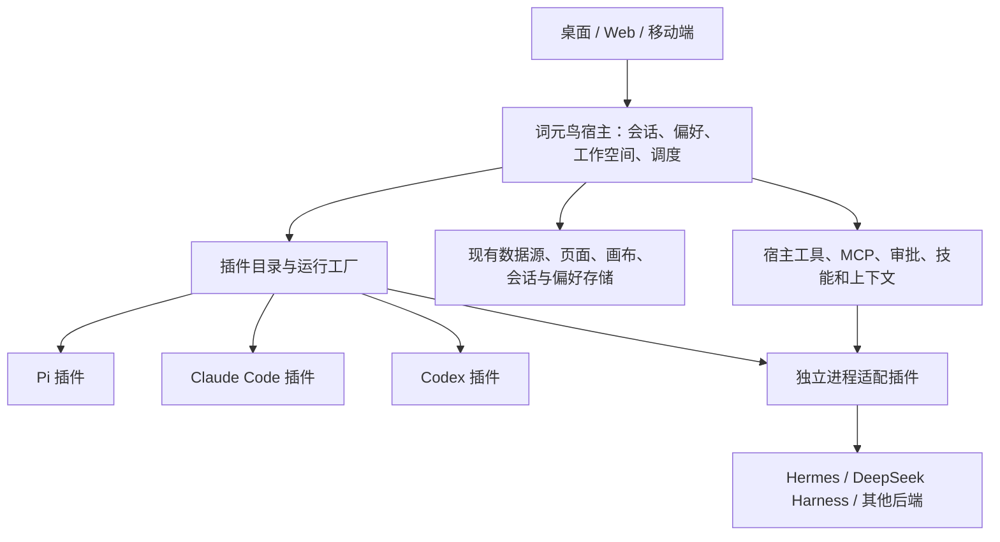

# 词元鸟：智能体插件宿主与迁移方案

词元鸟提供统一的智能体工作台和中间层。智能体后端独立拥有推理循环、原生工具与会话状态；词元鸟管理插件、用户偏好、工作空间、可共享工具、审批和任务编排。

本轮的产品边界是保留现有软件能力，接入不同的 agent 后端架构。数据源、页面、画布、会话、技能、审批与 Super Agent 编排继续使用现有存储和服务；后端适配器对接这些服务。首批后端为 Codex、Pi、Claude Code、Hermes、DeepSeek Harness（DSH）。

## 系统边界

模型连接负责模型协议、端点与凭据。智能体插件负责执行协议，两者分别管理。已有连接中的 `agentRuntime` 保留为兼容存储字段，扩展为稳定插件标识 `plugin:<id>`。用户选择插件后，缺失或禁用的插件必须显式报错，不能静默换成 Pi。

## 迁移顺序

1. 保留已有 Pi、Claude Code、Codex 的执行实现，统一通过注册工厂创建。保持 Codex 原生资格检查、连接配置隔离及兼容回退行为。
2. 引入版本化插件清单和独立进程协议。新后端只需适配协议，不需要修改 SessionManager、调度器或产品页面。
3. 把宿主工具定义提升为后端无关模块。外部插件通过宿主调用使用共享工具和审批，自己的推理循环继续留在自己的进程中。
4. 通过版本化偏好包迁移已有用户偏好与工作空间指令。用户默认设置继续使用现有存储，避免出现两套互相冲突的偏好。
5. 在 AI 设置中管理插件和迁移偏好；所有客户端使用运行智能体的服务器目录。

## 首批后端与能力保留

| 后端 | 原生执行入口 | 与现有产品的连接 |
| --- | --- | --- |
| Pi | Pi SDK / agent server | 保留已有实现 |
| Claude Code | Claude Agent SDK | 保留已有实现 |
| Codex | Codex app-server，连接不适用时保留已有兼容路径 | 保留原生资格检查与凭据隔离，兼容路径明确标记 |
| Hermes | `run_agent.AIAgent` | 通过宿主工具使用现有数据源、页面、文件与浏览器 |
| DSH | 官方 `deepseek-harness-sdk==0.1.5rc1` 与匹配原生运行时 | Cordis 工具插件对接相同宿主工具，DSH 保留自己的推理循环 |

Hermes 与 DSH 在目录中默认显示为尚未配置。点击一键下载安装即可建立独立环境并自动配置，也可填写服务器已有 Python 环境（Hermes 另需项目目录）。桥接脚本由服务器从当前安装资源解析。

### 后端框架设置

设置以五个可展开的框架条目呈现，不显示清单代码或协议能力标识。每个条目提供：

- **后端位置**：Codex、Claude 配置运行程序；Pi 配置 Bun 和服务入口；Hermes、DSH 配置 Python 环境，Hermes 另需项目目录。内置框架留空使用内置或自动检测的位置。路径属于运行智能体的服务器。
- **下载安装**：五个框架提供固定版本的安装配方，支持官方源与国内 npm/PyPI 镜像、阶段提示、取消与重新安装。下载到独立安装目录，验证成功才更新位置；失败保留旧配置。安装器不接收模型凭据，不修改系统智能体配置。
- **原生能力**：Hermes 保留原生执行器、工具发现、记忆、技能、指令、压缩、SessionDB 恢复和 steering；DSH 使用完整 sdk profile，保留原生插件和工具。共享工具追加到原生目录。Claude 普通会话恢复原生 Skill 与插件发现，受限节点继续执行已有隔离策略；Pi 继续使用原生资源加载器。
- **测试有效性**：测试当前未保存配置，检查位置、运行环境和本地通信；不保存配置、不读取模型连接凭据、不发起模型推理。Claude 检查其 SDK 运行程序的版本；Pi、Codex、外部桥接器检查各自本地协议，DSH 还启动真实原生运行时。
- **功能实现方式**：选择框架原生或词元鸟的历史恢复、辅助推理；设置执行中追加指令；管理文件与命令、数据源、页面与会话工具、浏览器操作。只提供适配器已实现的选项。原生 Codex 的文件工具没有宿主执行钩子，因此不提供无法可靠执行的关闭选项。

框架配置保存在 `agent-frameworks.json`；已有外部适配器仍使用 `agent-plugins.json`。修改配置会更新运行时签名，空闲会话重新创建后端，正在执行的会话在下一次启动时应用。禁用共享工具既会过滤外部框架的工具目录，也会在真实工具执行入口拦截；权限审批继续按现有策略执行。

选择词元鸟历史恢复时，不复用持久化原生会话 ID，以最近可见对话恢复新进程；隐藏推理状态不能恢复。选择词元鸟辅助推理时，标题、摘要和辅助查询由当前模型连接的传输实现，主智能体的推理循环保持在所选框架中。

偏好迁移提供文件导入、导出按钮，不要求用户编辑 JSON。

现有数据源和页面存储继续保留。外部后端接收同一套会话工具定义，包括页面读写、资源导入导出、数据源认证与测试；MCP/API 数据源继续由共享连接池提供。文件与命令默认使用框架原生实现，也可切换到宿主工具。原生调用先映射到宿主权限策略，再由框架自己的执行器执行；DSH 不允许工具参数原地修改，审批改写会要求模型按批准参数重试。

## 能力补充原则

宿主拥有偏好、工作空间指令、技能引用、显示历史与编排。插件声明原生恢复、流中引导、工具审批和辅助推理能力。宿主工具与 MCP 可以补充后端能力；原生隐藏状态、原生会话分支不能伪装为可跨后端无损迁移。

审批只能约束经过宿主的调用。适配器必须在原生工具执行前调用宿主授权，使用授权返回的参数；进程隔离本身不是文件系统沙箱。带严格节点执行策略的 Super Agent 会话只接受提供宿主工具及工具审批协议的插件，适配器是用户安装的受信执行代码。

Hermes 和其他后端通过实际适配器接入。通用协议不意味着未经适配的任意 CLI 可以直接运行。清单安装只保存配置，首次会话才启动进程；删除或禁用插件后，绑定连接明确不可用。
