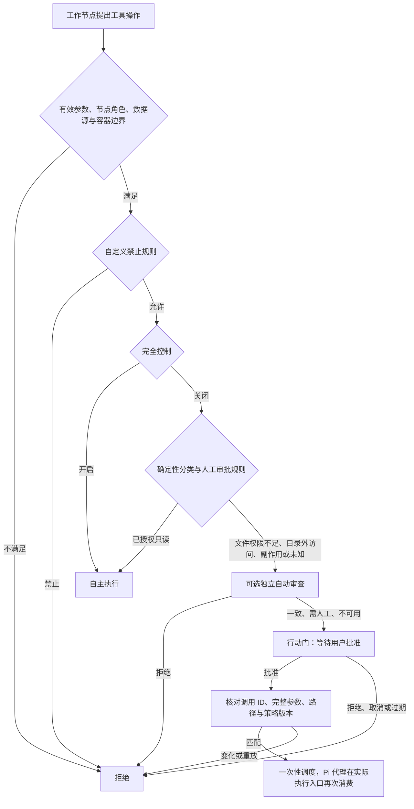

# 行动门、独立审查与固定授权边界

实现日期：2026-10-09。设计参考用户提供的 Dots Action Gates / Auto-review 描述；本文说明 TokenBird 的实现，不将该描述中的产品归属、Guardian 内部实现或物理隔离能力视为已核实的外部事实。

## 执行顺序

行动门由宿主执行，生产 registry 固定提供该机制。`fullControl`（完全控制）是审批总开关：开启时跳过全部人工审批、行动门与独立 Auto-review，可执行的待审批调用自动恢复。文件工具在完全控制下可直接访问宿主工作目录内外的路径；关闭时，目录外文件访问和未启用的文件能力发起一次性权限申请，获批后继续原调用。`allow-all` 本身不跳过行动门。分配的数据源、自定义禁止规则、网络和容器隔离仍生效。意图主节点与编排节点仍不能执行工作节点工具。

## 哪些操作需要批准

下表适用于关闭完全控制时；完全控制开启后，范围内操作直接执行。

| 操作 | 处理 |
| --- | --- |
| 授权目录内 Read / Glob / Grep / Find / Ls | 自主执行 |
| 浏览器 open / navigate / snapshot / find / scroll 等已列入检索合同的命令 | 自主执行；导航限 HTTP/HTTPS，使用实际浏览器及其登录状态 |
| 容器内经 AST 验证的只读系统查询 | 自主执行 |
| Write / Edit / MultiEdit / NotebookEdit | 每次调用人工批准 |
| 目录外 Read / Glob / Grep / Find / Ls，或未启用的文件读写能力 | 核验具体路径后申请一次性权限，获批继续原调用 |
| 浏览器点击、填写、上传等操作 | 副作用未知，逐次人工批准；evaluate 禁用 |
| 外部发信、发布评论、付款、采购、合并、部署等分配的数据源工具 | 逐次人工批准 |
| 未审核的数据源工具或其他未知副作用 | 保守地要求人工批准，即使名称或 `readOnlyHint` 声称只读 |
| 未分配的数据源、无法核验的路径、容器隔离限制、派生节点或额外模型工具 | 拒绝，人工批准不能放行 |

工具名称只辅助展示风险类别，不能证明没有副作用。数据库查询等数据源操作尚无经过宿主审核的只读合同，所以当前也需要确认；不能根据模型提供的提示或 MCP hint 自动放行。导航按浏览器检索合同处理，宿主无法保证远端服务遵守 HTTP 的只读语义。

协作自身的任务元数据、共享板版本更新、队内消息和向用户呈现结果属于已有协作功能，遵守角色、工作区、版本和队列校验，不视为给外部第三方发消息。它们不携带执行授权。

## 一次性审批

审批绑定提供商生成的调用 ID、规范化的完整执行参数、文件路径解析结果、当前策略代数与 10 分钟有效期。模型输入中的 `_intent` / `_displayName` 不参与授权；真正执行参数仍必须匹配。

关闭完全控制时，同一调用的多个检查阶段可以读取同一待执行许可，最终 PreToolUse 消费一次。Pi 通过 IPC 执行代理工具时还传递 toolCallId，再核对并消费一次；重放、参数变更、换节点、取消、换策略或更换容器句柄不能复用许可。同样内容的第二封邮件或第二笔付款需要新的审批。同步入口没有调用身份时不能自行执行有副作用的操作。开启完全控制时，两处调度检查都直接核对执行边界，不要求审批许可。

行动门不能选择「全队记住」，旧共享授权不会批准新行动门。历史审批仅用于显示，重启不恢复为执行许可。取消使尚未执行的许可失效；已发生的外部操作不能通过撤销审批回滚。

## 独立 Auto-review

在工作环境中明确启用，默认关闭。关闭完全控制时，启用会使用当前连接的模型额度；完全控制开启时不调用审查器，保留配置供关闭完全控制后使用。审查期间开启完全控制时，原请求按当前执行边界处理，不采纳旧审批模式的审查结果。

宿主创建独立运行时及无工具的临时推理上下文，只传原始用户消息、提出的操作与限制规则，不转入工作节点聊天历史、角色提示词或许可。Claude 禁用 tools、MCP 和设置发现；Pi 关闭活动工具、扩展、技能与项目上下文；Codex 连接使用已有 Pi 兼容传输，不依赖仍保留原生工具的 utility 会话。

输出仅接受严格 JSON：`consistent`、`needs-human`、`deny` 与原因。`deny` 阻止当前请求并报告自动审查拒绝原因；一致也需要人工批准。超时（30 秒）、连接错误、不完整结果和非法输出转为 `unavailable`，交人工决定。审查只能收紧处置，不能创建许可、改动沙箱、增加网络权限或放行被固定策略禁止的动作。

这是可能出错的模型判断，没有确定性安全或事实真实性保证。独立交付复核节点仍负责成果验收，与此处行动前审查是不同机制。

自定义规则按完整工具名匹配，只有 `deny` 和 `require-human` 两种效果；不能配置 `allow`。`deny` 始终生效；完全控制会跳过 `require-human`。登记脚本使用 `script-run` 规则名。

## 程序与控制数据隔离

没有沙箱也可执行宿主或客户端命令。关闭完全控制时，每次命令（包括只读检查）都必须得到用户对该调用的明确批准；审批卡说明完整命令、工作目录、实际执行设备及没有沙箱隔离。审批绑定调用 ID、参数、路径、策略版本和设备，只使用一次，拒绝、取消、过期或设备变化均阻止执行。开启完全控制时跳过人工审批和独立自动审查，不要求容器。已配置沙箱时继续使用原沙箱，不静默转移到宿主。

容器继续使用 `--read-only`、`--cap-drop=ALL`、`no-new-privileges`、CPU / 内存 / PID 限制及 `--network=none`，只挂载项目目录。生产宿主拒绝工作目录与 TokenBird 配置、凭据和协调数据目录重叠；旧节点恢复时也应用保护目录并开启行动门。Pi 工作节点不自动加载项目扩展，Claude 不加载项目设置钩子或发现的 MCP 程序。

关闭完全控制时，节点只能登记脚本与请求用户决定，不能通过最终 `runScripts` 自动启动。用户在脚本面板查看路径、参数及 SHA-256，点击「批准并运行」，宿主重新核对脚本内容、参数和环境。开启完全控制时，工作节点可用 `runScripts` 启动分配给自己的已登记脚本，用户也可点击「运行」，无需审批描述符。容器模式把捕获的入口内容只读挂载到原脚本路径；文件夹模式使用宿主解释器执行并保持原工作目录。宿主脚本没有沙箱隔离，引用的项目文件也不构成不可变依赖快照。

文件工具和浏览器工具仍由宿主中介执行；文件夹没有操作系统隔离。协调服务与策略服务也仍在现有服务器进程中，不宣称独立物理主机、容器漏洞免疫、整个网络的访问代理、任意代码内部每个系统调用的单独审批、不可篡改审计日志或自动费用预算。Bash 在已有沙箱中使用节点容器，没有沙箱时按上述审批规则执行；已经获批运行的内部进程不等同于可回滚的外部动作，进程生命周期与容器管理必须继续核实。

## 验证范围

回归测试覆盖完全控制跳过全部审批与审查、运行中切换恢复待审批操作、脚本直接启动，以及关闭后的只读自主执行、写入/外部副作用审批、不能共享或重放、参数变化、取消与策略撤销、能力与源边界、管理节点隔离、自动审查异常与非法输出、脚本版本绑定及项目扩展禁用。真实 Microsoft Agent Framework 测试继续验证图路由。

这些检查不代替真实提供商模型审查、真实浏览器提交、真实付款或生产 Docker/Podman 的集成验收；没有执行外部发送或付费操作来验证。
