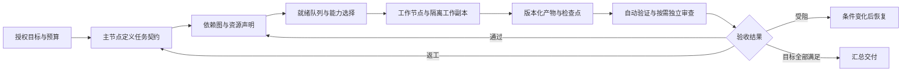

# 智能体协作底座与提示词改进

**2026-10-09 进展：** 意图/编排/执行三层已分离，已实现稳定任务 ID、依赖就绪释放、声明资源互斥、独立复核关系及结构化验收引用，详见 [当前分层编排](./research-orchestration.md)。以下保留 2026-10-07 的审查与后续路线；自动产物版本失效、能力发现和全局预算仍未实现。

## 1. 当前判断

本轮审查针对 2026-10-07 源码和本机代码团队。现有的持久会话、节点内串行、跨节点并行、计划版本、动作回执、通信预算、权限卡、网络恢复和运行存活对账，已经能支撑小团队完成具体任务。当前限制集中在任务依赖、共享资源、产物版本、验收与目标预算还没有统一结构，协调仍较多依赖主模型。

协作的基本单位应当是**有输入、负责人、产物和完成证据的任务**。节点数和“聪明”评级无法替代这些条件。代码团队中主力、轻量执行、疑难诊断、关键实现、独立测试和最终验收可以保留，但一次任务只调用有明确贡献的节点。

## 2. 本轮已经落地

| 改动 | 行为与边界 |
| --- | --- |
| 节点选择器 | 未指定节点时依次考虑恢复状态、忙闲、待处理轮次、启动限制、最近分派记录；显式指定节点仍优先。任务类型匹配由主节点负责，选择器尚无结构化能力匹配 |
| 可见调度信息 | 主节点上下文增加每节点队列、忙闲、恢复状态和启动时间下限；下限不预测任务结束时间，实际会话和环境仍在启动时验证 |
| 通信预算 | 本轮上下文提供剩余跳数与轮次数，避免节点盲目来回讨论；这是链预算，尚非目标总预算 |
| 会话连续性 | 调整名字、头像、描述、偏好、评级、速度、能力提示词时保留原节点会话；模型、连接、角色、思考强度、绑定数据源或环境变化仍按原方式交接。新提示词在下一轮同步 |
| 提示词结构 | 身份与执行边界、主节点/工作节点职责、合作交接与结果证据、动作协议、绑定能力分层；去掉固定第一个工作节点 ID 的示例 |
| 交接与恢复规则 | 明确阶段、输入版本、文件负责人、结果首行、证据范围、检查点、定向请求、部分成功动作恢复与版本合并 |

实现入口：

- [节点选择与身份判断](../../packages/server-core/src/super-agent/SuperAgentScheduling.ts)
- [协作系统提示词](../../packages/server-core/src/super-agent/SuperAgentPrompt.ts)
- [调度服务与上下文](../../packages/server-core/src/super-agent/SuperAgentService.ts)
- [协作回归](../../packages/server-core/src/super-agent/SuperAgentCollaboration.test.ts)

## 3. 应补齐的底座



图中任务依赖图、资源租约、结构化产物与验收是下一步设计，当前未全部实现。现有任务支持同一个计划下多个并行子任务，依赖顺序仍需主节点安排。

### 优先级一：任务契约、依赖与资源

| 框架 | 当前缺口 | 建议实现 | 完成判据 |
| --- | --- | --- | --- |
| 任务契约 | `instructions` 是自由文本，难以稳定提取依赖、范围和验收 | 增加兼容的任务类型、输入引用、输出约定、验收条件 ID、依赖与预算；由宿主校验引用 | 缺少输入不能启动；任务产物能逐项对应完成条件 |
| 依赖图与就绪队列 | 结果会唤醒主节点，但缺少确定性的依赖释放与补位 | 依赖无环校验、事件驱动的就绪队列、阶段释放规则、任务去重键 | 前置未满足时不启动；前置完成后立即补位，无需等待空闲自检 |
| 资源租约与执行隔离 | 同一目录的代码、脚本和外部记录可能被多个节点改写，提示词只能提醒 | 文件/目录/业务记录读写资源声明与持久租约；代码采用独立 worktree 或明确目录所有权 | 同一资源的冲突写入不能同时启动；取消与崩溃后租约有核验释放路径 |

建议把“依赖任务轮次完成”和“依赖产物通过验收”分别表达。检索的初稿可能足以释放整理工作；重要接口、黄金数据和正式交付应等待规定的验收状态。整个计划可包含多个可并行任务，依赖属于具体任务或产物。

### 优先级二：产物、验收与恢复

| 框架 | 当前缺口 | 建议实现 | 完成判据 |
| --- | --- | --- | --- |
| 产物登记与证据索引 | 文件路径、版本、运行命令和覆盖主要在自然语言中 | `artifactId`、输入/输出版本或 hash、生成任务、验证命令与结果、证据路径 | 验收与具体产物版本绑定；产物修改后旧证据不被继续引用为通过 |
| 结构化验收 | 当前 `task.completed` 主要表示正常轮次结束，不足以表达目标达成 | 增加与执行状态分开的 submitted/verifying/accepted/rework/blocked 验收记录，按条件保存证据 | 缺少必要证据不能验收；实现者自检与独立复核可以追溯 |
| 检查点与副作用幂等 | 有动作回执，仍缺少跨重试的执行键与阶段检查点 | 持久执行键、操作结果与未知状态、续做检查点、完成动作去重 | 部分成功后仅恢复剩余步骤；无法确认的发送、部署或脚本执行先核验，不能重放 |

只有系统内部状态或拥有外部幂等 API 的操作，才可自动按执行键去重。对付款、发送、部署等外部操作，模型自行声称“幂等”不产生保证。当前回执防止把被拒绝的动作说成成功，无法单独证明外部副作用是否发生。

### 优先级三：能力、预算、记忆与观测

| 框架 | 当前缺口 | 建议实现 | 完成判据 |
| --- | --- | --- | --- |
| 能力与健康注册表 | 描述和人工评级无法可靠表达任务适配；历史错误不等于实时不可用 | 结构化任务能力、来源与工具授权、当前连接健康、验收质量记录、显式回退路径 | 专门任务可按必要能力筛选；授权由宿主校验；错误恢复后可以重新参与 |
| 目标预算与进展诊断 | 链可以续接，32 轮不是整个目标的上限；多个节点共用连接可能限流 | 目标级轮次/token/费用/时间/返工预算，连接级并发与速率约束，进展指纹 | 重复无进展被识别；长期有进展可继续；预算紧张时聚焦最重要完成条件 |
| 可检索的任务记忆 | 当前上下文是有限摘要，索取完整条目主要依赖消息 | 按计划/任务/产物 ID 查询、状态过滤与分页；区分有效契约、暂定决策、证据和旧结论 | 按需取回完整要求与证据，保留来源和版本，不反复转发全队历史 |
| 事件与可观测性 | 多条进展可能分别消耗主模型轮次，指标难以归因 | 消息类型、事件 ID 与处理游标、结果合并、计划级 trace、真实调用增量计费、基准任务 | 用户请求和阻碍及时处理；进展不制造确认循环；等待、返工和成本能按任务解释 |

消息合并必须保留任务来源、事件顺序和投递确认。先实现有明确语义的事件，不应只用固定时间窗口把所有消息拼成一个长提示词。

## 4. 提示词还应完善的内容

### 4.1 任务分配必须具备可执行契约

现有任务 `instructions` 建议使用如下短模板，按任务需要填写：

```text
目标与完成条件：
输入与版本：文件路径/共享条目 ID/已确认接口。
负责人范围：允许修改的文件或业务记录；其他资源的负责人。
前置依赖：需要等待的具体产物和状态。
输出与证据：产物路径、版本、必要检查和报告路径。
边界与升级：授权范围；哪些问题需要主节点决定。
```

这是现有 `instructions` 的内容规范，不是新增动作字段。协议目前严格校验字段，在实现 schema、存储、调度和 UI 之前，不能在动作块中使用 `dependsOn`、`leases`、`acceptance` 等提议字段。

### 4.2 节点协作以信息与产物为中心

- 主节点决定目标、分工、公共接口、文件负责人和验收条件。
- 工作节点可定向请求已知依赖或澄清，只使用当前任务给出的有效节点/会话地址；未知地址或改变分工时找主节点。
- 共享板保存冻结契约、决策理由、阶段检查点和产物索引；原始长日志保存在文件中。
- 没有新证据、产物、阻碍或待决问题的消息不单独发送；完成结果由宿主汇总，避免再发送同一结果。
- 工作节点发现版本冲突时停止冲突写入，提供差异与影响；禁止用覆盖文件的方式“解决”他人的变更。

### 4.3 自主推进要有终止和升级条件

持续工作遵循已授权目标与完成条件。自检间隔控制空闲复盘，无法替代事件驱动的任务补位。新证据或新产物可以支持继续定位；相同错误反复出现且没有进展时应升级诊断或明确受阻。

缺少关键输入、授权或外部依赖时，记录具体解除条件。结果未知时核验现有操作，不从头重做。所有完成条件达成后交付并等待；空闲复盘可以检查遗漏，但不能自行制造新的目标。

### 4.4 按任务风险选择验收方式

| 场景 | 基础证据 | 何时增加独立审查 |
| --- | --- | --- |
| 代码 | 同一版本差异、相关构建/测试、边界复现、未验证项 | 跨模块设计、安全/数据影响、疑难失败、关键算法 |
| 科研 | 原始来源、数据与参数、基线、复现命令、不确定性 | 核心结论、统计与因果解释、可疑反例或复现差异 |
| 高效工作 | 来源、数字口径、文件与链接可用性、实际交付状态 | 关键数字、对外材料、重要业务记录修改 |
| 日常 | 最新事实、实际操作结果、产物与来源 | 涉及重要决定或操作结果无法确认 |

工作节点的结果首行可标为“已验证完成 / 部分完成 / 受阻 / 需要协调”，随后说明产物、证据与剩余条件。当前标签只是文字约定，不能自动改变宿主状态；主节点仍须读取内容和动作回执判断。未来的结构化验收应替代对这些文字标签的解析。

## 5. 对当前本地代码团队的建议

保留现有 9 节点分层。主力工程师承担日常设计实现；轻量节点承担输入和边界明确的局部实现、脚本或整理；疑难专家和关键复核专家分别负责问题定位和独立证据；关键实现节点承担高难度集成；测试负责实际验证，验收负责原始目标逐项覆盖。

默认流程：

1. 主节点确认目标、契约、文件负责人和阶段完成条件。
2. 主力实现；轻量节点并行准备独立资料、脚本或明确模块；测试可提前设计用例。
3. 输入与实现版本就绪后实际测试，失败带复现和证据回到具体负责人。
4. 只在重要设计或未解释的失败时调用专家；通过证据不足时继续核验。
5. 验收检查原始目标、证据版本、交付完整性和遗留条件，主节点汇总。

不要求每个任务走完全部节点。成本与质量的改善需用实际基准任务测量，不能从节点数、思考强度或模型名直接推定。

## 6. 推荐下一步实施顺序与验证

任务契约、资源声明、结构化验收、依赖释放和三层分工已经落地。此次进一步实现了目标修订、检查点续做、条件等待、工具操作去重、未知结果保护、产物版本验收、连接预算、结果汇总合并与持久指标，详见 [任务持续性与执行效率](./continuity.md)。

后续重点是跨进程事务与任务租约、真实任务质量基准、模型 usage 与成本预算、检索记忆的有效期和来源追踪。实际性能收益须测量；便携文件状态不能代替多服务实例共同调度时的数据库事务。

建议使用冻结输入的真实任务验证：

- 多节点实现同一接口，测试只在规定的版本就绪后运行。
- 两个节点请求修改相同文件，验证冲突执行被阻止并可协调。
- 外部操作完成后连接中断，恢复时核验结果而不重复发送。
- 构建成功但用户要求遗漏，任务轮次结束后仍不得验收计划。
- 多个普通进展、一个关键阻碍同时到达，确认没有丢事件和确认循环。

记录目标完成时间、首轮验收通过率、就绪等待、提交到验收等待、主节点协调轮次、返工与资源冲突、实际 token 和费用。当前的调度回归测试检查确定性机制；真实模型的任务质量、成本和提示词遵循度需要单独基准验证。
