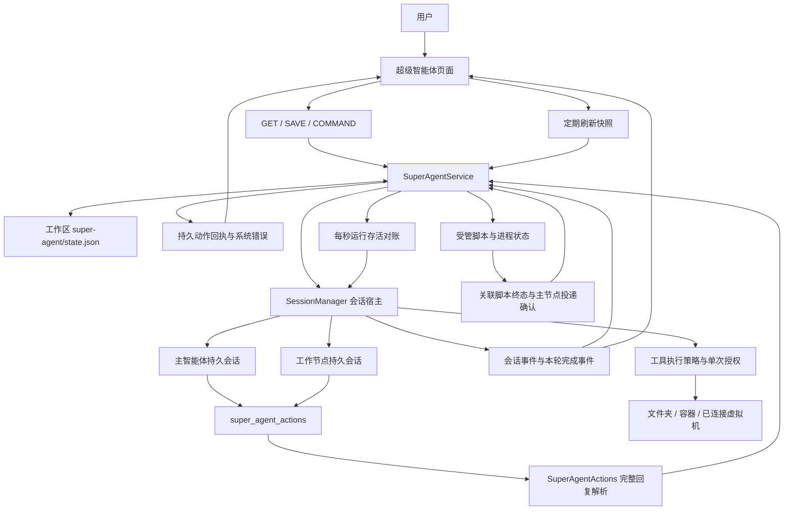
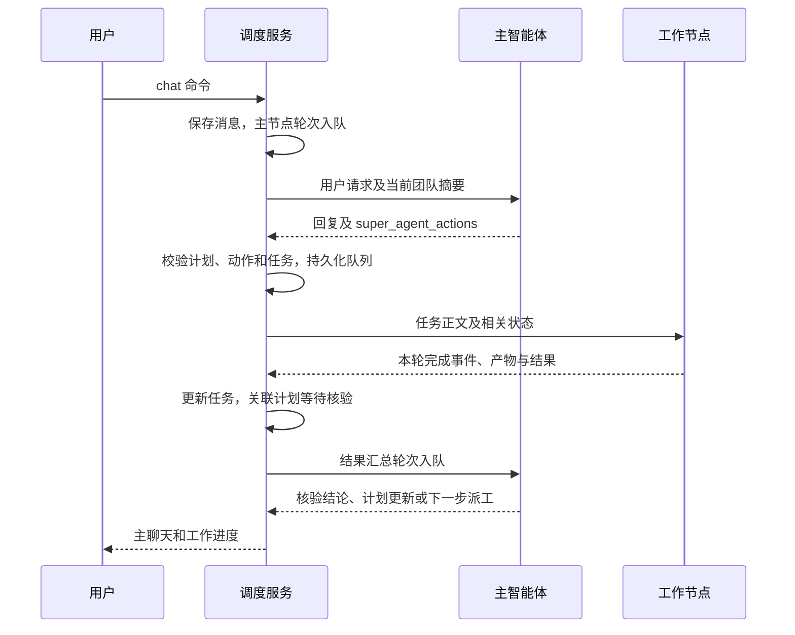

# 超级智能体当前设计

## 1. 范围与设计原则

本文依据 2026-10-04 当前源码，说明已实现的结构和执行规则。文档不作为某个已安装版本已经更新或通过测试的证明。

超级智能体是工作区内的持久团队：用户通过主智能体提出目标，主智能体维护计划并向已有工作节点派工，后台服务将动作转换成真实会话轮次和工具执行。

核心原则：

1. 模型提出操作，宿主校验和执行操作。
2. 模型会话按节点复用，节点轮次串行，独立节点可以并行。
3. 计划、执行任务、模型轮次和通信消息分别记录。
4. 工具权限由宿主检查，提示词提供职责和操作协议。
5. 状态依据实际事件和运行存活对账更新，排队、开始、提交结果与目标验收分别呈现。
6. 持续工作围绕用户已授权目标推进；恢复时保留可能已经发生的文件和程序副作用。

## 2. 系统架构



### 2.1 模块职责

| 模块                       | 职责                                                                       |
| -------------------------- | -------------------------------------------------------------------------- |
| Electron 页面              | 首次设置、主聊天、工作进度、计划、节点、共享板、通信、资源、脚本、权限卡   |
| RPC 处理器                 | 校验工作区归属，提供读取、保存配置及发送命令入口                           |
| `SuperAgentService`      | 工作区串行状态修改、排队、限速、派工、回执、存活对账、脚本结果投递、巡检与版本检查 |
| `SuperAgentActions`      | 从完整回复提取末尾单个动作块，识别围栏示例，报告格式或大小错误并过滤最终显示文字 |
| `registry`               | 为会话宿主创建服务，连接现有模型与数据源目录，恢复工作区团队，清理服务     |
| `SuperAgentPrompt`       | 构建节点身份、职责、动作协议和当前执行规则                                 |
| `SessionManager`         | 创建隐藏节点会话、调用提供商、接收工具与完成事件、应用执行策略             |
| 执行策略                   | 检查文件路径、工具能力、数据源、通信与禁止的派生操作，管理具体操作授权     |
| `SuperAgentEnvironments` | 检查环境可用性，准备和回收容器，验证虚拟机宿主身份                         |
| shared 类型、校验和存储    | 定义配置、状态、命令与磁盘格式，严格校验并保存团队状态                     |

服务生命周期绑定会话宿主；团队状态按工作区隔离。RPC 要求使用规范工作区 ID，拒绝与连接上下文不一致的工作区访问。

## 3. 团队与模型连接

### 3.1 节点结构

团队总节点数为 **2～32**：恰好一个 `coordinator`，至少一个 `worker`。

| 字段                                            | 含义                                |
| ----------------------------------------------- | ----------------------------------- |
| `id`、`role`、`name`、`avatar`          | 稳定身份、角色和展示信息            |
| `description`、`workPreferences`            | 职责和工作偏好，供主节点选择分工    |
| `llmConnection`、`model`、`thinkingLevel` | 已配置连接、文本模型和思考强度      |
| `maxCallsPerMinute`                           | 模型轮次启动频率，范围 0.1～60      |
| `intelligenceRating`                          | 1～5 的配置评级，作为调度上下文信息 |
| `sourceSlugs`                                 | 节点绑定的数据源                    |
| `abilityProfileIds`                           | 节点使用的能力档案                  |

保存时检查连接存在、凭据可用、模型属于配置目录及 TokenNest 当前分组，拒绝图像生成模型。数据源和能力档案引用必须有效。

### 3.2 角色分工

- **主智能体**：处理用户对话、维护计划、选择工作节点、巡检、核验结果和汇总；主要工作优先派给工作节点。
- **工作节点**：执行当前任务，提交产物和证据，发送必要消息，更新共享板；不得分派任务或修改计划。
- **后台调度器**：执行结构校验、队列和权限规则，不替代主智能体做任务拆分或验收判断。

每个节点首次执行时创建隐藏会话，后续轮次复用。每轮开始前重新同步 Execute 模式、最新提示词及执行策略。修改节点或环境等配置可能重置当前节点会话绑定；历史会话仍由会话系统保存。存活对账确认异常停止且没有本轮完成事件时，会解除旧会话绑定，让后续工作使用新会话，避免晚到事件误认新的轮次。

### 3.3 节点选择与并行度

任务显式指定 `nodeId` 时使用该工作节点；未指定时，服务选择待处理轮次数最少的工作节点。相同负载下按配置中的现有顺序选择。

当前没有“两节点上限”。也没有让全部节点自动参与的机制：实际并行度取决于主节点拆出的任务、指定节点、计划关联以及节点队列。

服务端没有依据模型价格、评级或专长自动计算分工的优化器。这些配置供主智能体参考。依赖关系主要写在计划和任务说明中，由主智能体控制前后步骤；当前没有独立的依赖图执行器。

## 4. 数据模型与状态

### 4.1 对象关系

| 对象                            | 作用                                                   | 关键关联                                            |
| ------------------------------- | ------------------------------------------------------ | --------------------------------------------------- |
| `SuperAgentConfig`            | 团队名称、节点、环境、持续工作、数据源、能力和脚本配置 | 工作区                                              |
| `SuperAgentPlanItem`          | 用户目标、完成条件、优先级、进展和阻碍                 | `id`、`revision`                                |
| `SuperAgentTask`              | 分派给某个工作节点的执行任务                           | `planId`、`nodeId`、执行 `sessionId`、`actionReceipt` |
| `SuperAgentPendingTurn`       | 待执行或已开始的模型轮次                               | `nodeId`、可选 `taskId / scriptRunId`、`chainId`、`depth` |
| `SuperAgentNodeRuntime`       | 节点会话绑定和运行状态                                 | `sessionId`、`activeTaskId`                     |
| `SuperAgentMessage`           | 持久通信和用户汇报                                     | 发送者、接收者、种类、可选任务和 `actionReceipt` |
| `SuperAgentActionReceipt`     | 本轮控制动作的实际执行结果                             | `turnId`、已应用、被拒绝、未尝试动作及实际目标 ID |
| `SuperAgentBoardItem`         | 团队共享事实、产物路径和协调信息                       | 条目 ID、版本、修改者                               |
| `SuperAgentScriptRuntime`     | 登记脚本的执行与结果交付状态                           | `scriptId / runId / taskId / planId`、hash、退出码、投递状态 |
| `SuperAgentNodeActivity`      | 当前提供商输出及工具活动                               | 节点、会话、可选任务；仅运行时保存                  |
| `SuperAgentPermissionRequest` | 具体工具操作的待处理授权                               | 节点、会话、操作范围和有效期                        |

计划优先级为 1～5，**1 最高**。未指定 `planId` 的任务自动创建一个优先级为 3 的关联计划。

### 4.2 状态语义

| 对象 | 状态                                                                    | 含义                                                     |
| ---- | ----------------------------------------------------------------------- | -------------------------------------------------------- |
| 节点 | `idle / preparing / working / error`                                  | 空闲、准备环境或会话、正在执行、轮次失败                 |
| 任务 | `queued / running / completed / failed / cancelled`                   | 已排队、已开始、本轮成功提交、失败、停止                 |
| 计划 | `planned / active / blocked / completed / cancelled`                  | 待安排、推进中、受阻、已验收完成、已取消                 |
| 脚本 | `idle / running / completed / failed / stopped / missing / untracked` | 空闲、运行、成功、失败、停止、文件缺失、进程状态无法确认 |
| 授权 | `pending / approved / denied / expired`                               | 等待、允许、拒绝、过期                                   |

工作节点轮次成功结束时，任务变为 `completed`，关联计划通常为 `active`，等待主节点验收。任务失败、被停止，或关联脚本失败、状态未知及结果交付失败时，计划变为 `blocked`。

任务 `completed` 表示模型本轮正常结束并提交结果，不能单独证明产物通过测试或整个用户目标完成。主节点通过证据核验后再更新计划状态；宿主不会自动证明自然语言完成条件。

一个计划或阶段可以关联多个 `queued` 或 `running` 子任务，使用相同 `planId` 分派给多个工作节点。独立子任务在不同节点上并行，同一节点上的任务按队列串行；已有具体子任务不应重复分派，有依赖的工作需等前置结果。同一计划仍有任一活动任务、运行或 `untracked` 脚本、待投递或尚未确认的脚本结果时，不能关闭或删除计划；关联脚本失败或停止时也不能把计划标记为完成。任一子任务失败或停止会使计划受阻，其他子任务成功不会自动解除或覆盖已记录的阻碍。`blocked` 计划需要先经检查恢复到可执行状态，才能再次派工。

脚本结果交付分别记录 `resultPending`、`resultQueuedAt` 和 `resultReportedAt`，并保存 `resultDeliveryAttempts / resultDeliveryPaused / resultDeliveryError`。模型轮次成功、动作成功、脚本成功、结果交付确认和计划验收是分别检查的状态。

## 5. 调度与轮次生命周期

### 5.1 用户请求到结果



### 5.2 串行与并行

工作区状态修改通过 `serial()` 串行执行，避免队列和版本竞争。环境准备、提供商调用等长操作放在状态锁之外，保持读取和停止响应。

同一节点只能执行一个轮次。调度同时检查节点状态、启动中标记和实际会话 `isProcessing`，防止队列外会话执行造成重入。不同节点分别调度，可以同时工作。

工作节点按自身队列顺序执行；主节点在选择下一轮时优先处理用户 `chat`，然后处理其他已排队轮次。该优先级不打断已经开始的轮次。

启动间隔至少为 `60_000 / maxCallsPerMinute` 毫秒。这个设置控制轮次启动频率，不能控制生成 token 的速度，也不能保证任务完成时间。

### 5.3 执行步骤

1. 在锁内选取轮次，记录 `preparing`，但暂不记录轮次 `startedAt`。
2. 在锁外检查环境，首次创建或复用节点会话。
3. 应用最新执行策略和提示词，配置变化时重新核对。
4. 在锁内再次确认轮次未被取消、会话没有被其他入口占用。
5. 持久化轮次开始、节点 `working`、任务 `running` 及实际执行会话。
6. 在锁外调用会话宿主，接收真实工具和提供商事件。
7. 完成事件更新任务、计划和消息；从完整回复解析动作，保存实际回执，确认关联脚本结果投递，安排主节点核验和下一轮。

### 5.4 本轮完成事件

完成处理只使用当前完成事件的 `finalText`，不回退到会话历史中的最后一条回复。

会话完成解析器结合本轮开始前的回复 ID、当前回复 ID、最新用户消息和错误消息判断结果。没有产生新最终回复的“完成”会转为错误；本轮终结错误优先报告。原生 `/compact` 可以用本轮 `compaction_complete` 通知确认成功，无需生成普通助手回复。这样可以避免连接失败后重放旧回复及其派工动作。

取消会先持久删除相关轮次、更新任务状态，再请求停止实际执行。取消后的晚到完成事件不能恢复已取消任务。停止失败会记录实际错误，仍需核对会话或进程状态。

### 5.5 运行存活对账

服务每秒调用 `tick()`，核对已经记录 `startedAt` 的轮次与宿主会话状态。轮次开始先留 **10 秒**宽限；之后需在至少相隔 **1 秒**的两次检查中确认会话停止、缺失或归属异常，才补齐错误终态。第一次发现停止时让已排在工作区锁后的真实完成事件先处理，降低正常完成与计时检查发生竞争时的误判。

实际 `isProcessing=true` 的长任务和权限等待继续执行；宿主查询异常保留原状态。确认停止后，任务失败、关联计划受阻，结果记为未知，原会话 ID 保留在错误说明及任务记录中。服务解除该旧会话绑定，并向主节点安排一次核验；普通任务的通信链已耗尽时，诊断仍可使用新系统链交付。

对账使用宿主当前状态，不读取历史最终回复、不猜测本轮产物是否成功，也不自动重放可能已经产生副作用的任务。普通主节点核验轮次本身失败后不会无限生成下一轮核验；带 `scriptRunId` 的结果轮次按脚本交付重试预算处理。

## 6. 动作协议与节点通信

### 6.1 模型动作块

模型在回复末尾输出至多一个 `<super_agent_actions>` 严格 JSON 块。服务只在本轮成功时从**完整、未截断回复**中解析控制块，最终显示文字最多保留 **64,000 字符**，动作块正文独立限制为 **256,000 字符**。

真正的动作块必须使用准确标签，位于 Markdown 围栏之外，结束标签之后只允许空白。未闭合、嵌套、多块、错误标签、块后正文及超限控制块产生明确协议错误；非法 JSON、未知字段和无效引用由后续校验拒绝。围栏中的动作示例作为普通代码保留，不参与派工，也不会被最终文字过滤误删。

| 动作                | 允许的角色 | 作用                                             |
| ------------------- | ---------- | ------------------------------------------------ |
| `plans`           | 主节点     | 创建或更新计划，提交`expectedRevision`         |
| `tasks`           | 主节点     | 向工作节点分派任务，可带`planId` 和 `nodeId` |
| `messages`        | 所有节点   | 向已有节点或其他全队节点发送消息                 |
| `board`           | 所有节点   | 创建或更新共享条目，模型提交版本                 |
| `registerScripts` | 工作节点   | 登记自己生成的脚本                               |
| `runScripts`      | 工作节点   | 在允许的环境中运行分配给自己的脚本               |

每轮所有动作合计最多 **8 个**，其中任务最多 **4 个**。未知字段和无效引用会被拒绝。

示例中 `worker-a` 应替换为实际已配置工作节点 ID：

```json
{
  "plans": [
    {
      "id": "verify-artifact",
      "title": "验证交付产物",
      "instructions": "读取指定产物，运行已有验证，记录通过与未覆盖项。",
      "status": "planned",
      "priority": 2,
      "note": "",
      "expectedRevision": 0
    }
  ],
  "tasks": [
    {
      "nodeId": "worker-a",
      "planId": "verify-artifact",
      "title": "执行独立验证",
      "instructions": "目标；必要路径和授权范围；依赖；产物与验收条件。"
    }
  ]
}
```

动作按 **计划 → 共享板 → 任务 → 消息 → 脚本登记 → 脚本运行** 顺序处理。动作块不是事务：后续动作失败时，前面已成功的修改可能保留。因此刷新和重试前必须检查计划、活动任务及条目版本，避免重复执行。

每个动作块生成 `SuperAgentActionReceipt`，总体状态为 `applied / rejected / partially_applied`。回执保存逐项动作 ID、类型、真实 `targetId`，列出 `applied`、首个 `rejected` 的错误及后续 `notAttempted`。创建新计划、共享条目或任务时记录宿主实际生成的目标 ID。

工作节点回执随任务结果保存并进入主节点汇总；主节点没有工作任务的聊天轮次也把回执保存到结果消息。协议或执行拒绝会通知来源节点、主节点和用户。已有任务产物和模型结果保留，主节点根据回执检查未成功部分；外部文件及程序副作用仍需核对实际产物与执行记录。

### 6.2 通信入口

节点可以通过动作块中的 `messages`，或 `mcp__session__send_agent_message` 发送进展。后者使用当前团队 `runtime` 中的目标 `sessionId`；目标尚无会话时使用节点 ID 动作。

宿主把节点会话通信接入同一持久队列，要求发送者处于活动轮次，发送者和接收者属于同一工作区当前团队；拒绝向自身发送。附件使用共享文件路径引用。

返回 `queued` 表示队列已经接受消息。读取、处理及完成发生在接收节点后续轮次，仍遵守串行和限速。广播发给除发送者外的全部配置节点，每个接收者消耗一轮预算；纯确认消息不要求回复。

### 6.3 通信链限制

每轮携带 `chainId` 和 `depth`。普通后续派工、结果汇总和消息沿原链累积深度及轮次预算：

- 通信深度最多 **6 跳**。
- 每条通信链最多入队 **32 个模型轮次**，包括分支和广播。
- 工作区待处理轮次最多 **200 个**。

这些限制约束模型之间的调用传播。它们与团队节点数量、单节点启动速率分别生效。

脚本终态和异常停止诊断可通过独立系统链交给主节点。脚本结果自动投递另有最多 **3 次**的确认预算，详见第 11 节。

## 7. 持续工作与巡检

### 7.1 两类巡检

| 模式         | 触发条件                                                                                      | 目标                                         |
| ------------ | --------------------------------------------------------------------------------------------- | -------------------------------------------- |
| 普通巡检     | 持续工作关闭；距用户活动或上次巡检达到`idleInspectionMinutes`，且存在需检查的任务或脚本活动 | 检查进度、阻碍和结果                         |
| 持续工作自检 | `continuousWork=true`；全队连续空闲至少 30 分钟                                             | 检查授权目标的遗漏，维护计划并安排可执行步骤 |

`continuousWork` 默认关闭。开启后，主节点收到结果时会被提示推进后续计划；30 分钟自检用于全队空闲后的再次唤醒。`idleInspectionMinutes` 可设 1～1440 分钟，不改变持续工作固定的 30 分钟空闲阈值。

空闲自检要求没有排队轮次、准备或运行节点、启动中的执行、待处理授权、运行脚本或 `untracked` 脚本。服务还检查节点实际会话，队列之外仍在处理的会话也阻止自检。

自检由服务端计时，不依赖页面打开。没有可执行剩余工作时记录结论，再计算新的空闲期；不会为了保持忙碌增加用户目标。

### 7.2 跨通信链推进计划

持续工作下，主节点派出的全部后续任务都关联已存在的 `planned` 或 `active` 计划时，服务允许在原链预算耗尽后以深度 0、新 `chainId` 开启下一阶段。

关联未完成计划的工作任务到达链边界后，仍可开启新链将结果交给主节点核验。工作失败时，核验对象可以是受阻计划，但重新派工前必须恢复计划到可执行状态。

普通节点消息仍受原通信链限制。新阶段规则不会放开消息、脚本或未关联有效计划的派工；同一个动作块夹带达到限制的消息或脚本仍可能被拒绝。

### 7.3 开关与停止

- 关闭持续工作：立即保存，取消尚未开始的后台自检，保留已开始的轮次及其他已排队工作。
- 停止单个任务：取消相关执行，保留团队的持续工作开关。
- 停止全部工作：关闭持续工作，取消团队模型轮次，暂停未确认脚本结果的自动补交；受管脚本进程通过脚本停止命令单独停止。
- 服务退出：结束后台计时；恢复时重新计算空闲期，不把停机时间算作已确认空闲。

## 8. 共享板、计划版本与冲突恢复

计划和共享板采用条目级递增 `revision`。创建计划提交版本 0；更新和删除计划必须匹配当前版本。模型修改共享板也携带 `expectedRevision`；共享板控制命令的类型允许省略版本，提供版本时服务检查匹配。

冲突时保留已有内容，记录实际当前版本并拒绝该修改。主节点遇到版本冲突且原链仍有深度、轮次和队列空间时，服务安排一个刷新与协调轮次，要求读取最新状态、检查此前已成功的动作，再分派剩余工作。

主节点的版本冲突、动作协议错误、非法 JSON 和 schema 校验错误，可在原链预算内获得协调轮次。回执明确已应用和未成功部分，协调提示要求只修复剩余操作。工作节点失败通过任务回执交主节点判断；预算耗尽或其他业务拒绝保留可见错误，不进行无限刷新重试。

## 9. 提示词与上下文

固定提示词描述身份、职责、实际工具协议、权限、计划及通信规则。能力档案按节点绑定加入。脚本协议仅在节点已分配脚本或本轮任务涉及脚本时加入。

每轮单独附带一次任务正文和 `Current team state` 摘要：

- 工作节点主要获取自己与主节点的通信地址、当前任务、相关计划、少量共享条目及近期相关消息。
- 主节点获取全队节点信息、活动及近期任务、未完成计划和协调信息。
- 不在摘要中重复完整任务正文、已包含于本轮消息的结果或无关脚本输出。
- 长内容用带 `[…]` 的节选，保留条目 ID、版本和文件路径，便于索取详细证据。

精简上下文不等于删除节点历史会话；各节点仍使用持久会话。团队状态中的任务正文保留完整分派要求，但任务和通信历史有数量上限和裁剪规则。

## 10. 执行模式、权限和环境

### 10.1 Execute 与能力设置

所有节点统一使用 `allow-all`（Execute），旧 `safe / ask` 配置加载时归一化。执行模式与超级智能体能力策略独立。

`fullControl` 默认开启，包括旧配置缺失该字段的情况。开启后主节点和工作节点可以直接读写文件、运行程序、操作浏览器及使用实际配置的数据源，也可访问工作目录外路径。实际执行账号、连接凭据和环境隔离仍决定可执行范围。

完全控制也保留团队结构规则：不能派生额外智能体、额外调用模型或通过工具绕过团队调度。节点通信走已有团队队列。

受限控制下，能力分为 `readFiles / writeFiles / runPrograms / browser`。主节点的直接写文件和运行程序能力被关闭，工作节点按环境开关执行；缺少具体能力或路径范围时通过宿主申请操作授权。内置说明、实际绑定的数据源说明及通过语法检查的只读设备查询可自动放行。

### 10.2 具体操作授权

授权绑定节点会话、工具名、完整输入、实际执行目标及有效期。允许后继续原工具调用；拒绝、过期和停止结束等待。主节点收到申请说明，用户在主聊天权限卡处理。

单次授权只在当前轮次有效，最长 10 分钟，轮次结束、取消或策略变化时撤销。它不扩大整个工作目录的权限。客户端 `localbash` 的目标在申请时锁定，客户端断开后不会换到另一台机器执行。

结构上禁止的派生操作或不支持的工具直接报告错误，不转换成可批准的权限申请。持久权限记录仅用于显示，重启不会恢复授权能力。

### 10.3 工作环境

| 环境        | 执行位置与边界                                                                                                  | 准备方式                                                              |
| ----------- | --------------------------------------------------------------------------------------------------------------- | --------------------------------------------------------------------- |
| `folder`  | 当前服务器或所选客户端的实际账号；受限文件操作校验根目录、符号链接和 Windows junction；文件夹本身不提供系统隔离 | 验证真实目录                                                          |
| `sandbox` | Docker / Podman 容器中的程序；仅挂载所选目录到`/workspace`，文件工具仍使用宿主路径                            | 执行时创建节点容器；快照读取不启动容器                                |
| `vm`      | 已连接虚拟机内的 TokenBird 服务                                                                                 | 服务设置`TOKENBIRD_EXECUTION_HOST=vm`，配置工作区 ID 与实际服务一致 |

容器基础约束为：系统只读、关闭网络、移除 capabilities、禁止新增权限，限制 128 个进程、1 GiB 内存和 2 CPU；`/tmp` 使用临时文件系统。项目挂载是否可写由实际控制和写能力决定。

节点容器可以跨串行轮次复用；受管脚本使用独立临时容器。浏览器和授权数据源经现有宿主服务提供，不代表它们运行在节点 Shell 容器里。

虚拟机模式要求用户先连接已有服务；页面不创建或启动虚拟机。

### 10.4 配置更新

一般配置修改要求先停止运行或排队工作。文件夹和虚拟机环境仅切换 `fullControl` 时允许在工作期间更新；沙箱需要重建挂载，仍要求先停止。

关闭完全控制会撤销当前及历史隐藏节点会话的全权访问；开启后继续原先可用的待授权调用。开启失败撤回新增全权访问，撤销失败不会重新开启全权。环境清理失败时返回已保存配置和明确错误，避免把已保存状态描述为未保存。

## 11. 数据源、能力档案和脚本

数据源复用工作区已有目录和凭据。团队 `sourceSlugs` 是受限绑定池，节点绑定必须是其子集；完全控制时可使用实际可用的数据源，但仍需要有效连接和凭据。

能力档案保存可复用指令，可从已有工作区技能导入，并通过 `abilityProfileIds` 分配给节点。

脚本管理器支持 `.js / .mjs / .cjs / .py / .ps1 / .sh`。登记记录脚本文件和 SHA-256，后台约每 5 秒扫描文件变化；登记和修改都不会自动运行或重启脚本。

工作节点只能登记及运行分配给自己的脚本，不能替换其他节点脚本。完全控制下文件夹或虚拟机可运行目录外脚本；容器脚本必须位于挂载目录内。受限控制自动运行登记脚本要求沙箱，受限宿主登记脚本由用户启动且需要全部环境能力。

运行使用明确解释器和参数，不拼接 Shell 字符串；仅传递基础运行环境变量，不转发模型提供商凭据。超时时间范围为 1～86400 秒，脚本输出截留最近 64000 字符。

停止或超时会终止宿主进程树或实际远端执行器。CLI 退出但执行器无法确认停止时记为 `untracked`，阻止重复启动和持续工作空闲自检，直到人工复查并重新登记。

### 11.1 执行关联与结果交付

每次受管执行生成独立 `runId`。工作任务通过动作启动的脚本同时绑定 `taskId` 和 `planId`；手动启动可没有任务关联。原模型任务提交后，脚本仍可能运行，计划需要继续等待该运行及其结果交付。

脚本成功、失败、停止、无法确认停止及绑定任务的启动失败，都以系统终态直接入主节点 `summary` 队列。轮次携带 `scriptRunId` 关联结果，不使用原 `taskId` 再次完成工作任务。队列满时结果保留为待投递，空位释放后补交；相同运行已有待处理结果轮次时不重复入队。

入队只记录 `resultQueuedAt`。主节点结果轮次正常完成后才写 `resultReportedAt`，表示该运行结果已交付给主节点；计划仍由主节点检查实际证据后验收。暂时网络、代理、服务和限流错误保留同一结果审核轮次，按网络恢复策略续跑，不确认交付、不重跑脚本，也不增加结果投递次数。其他结果轮次发送失败、丢失完成事件或重启中断时保留原运行结果，并最多自动尝试 **3 次**投递。达到上限后记录错误、通知用户并暂停自动补交。

用户取消会移除相应运行的待核验轮次并暂停未确认结果的后台补交；取消单项任务保留主节点正在处理的其他工作。用户显式继续团队或请求巡检后可恢复投递并重新建立尝试预算。重试投递只提交已记录结果，不重新启动脚本。关联脚本或结果尚未解决时，计划保持受阻或待核验。

文件监测不会把已结束运行的成功、失败或停止状态改为 `missing`，也不会覆盖运行输出及投递状态。文件缺失单独记录错误，原执行证据继续保留。

## 12. 持久化与恢复

暂时网络、代理、服务和限流错误不会立即结算为任务失败。节点进入 `recovering`（恢复中），持久化同一轮次的 `retryAt`、`retryAttempt`，保留任务、计划和原会话。重试间隔依次为 2、4、8、16、32 秒，之后每 60 秒继续，直到成功、用户取消或出现非暂时性错误；重试不消耗额外通信链预算。续跑提示要求检查已有工具结果和产物，避免重复已完成操作，未知操作结果必须先核实。认证、余额、权限错误及丢失完成结果仍按终态处理。取消会删除对应恢复轮次；关闭持续工作会移除等待恢复的后台自检。

服务重启可继续已持久化且处于等待间隔的恢复轮次；已开始却无法确认结果的执行仍遵循下述中断核验规则。

### 12.1 磁盘格式

团队保存于 `<workspaceRoot>/super-agent/state.json`：

```json
{
  "version": 1,
  "config": null,
  "state": {
    "version": 1,
    "revision": 0,
    "nodes": [],
    "tasks": [],
    "messages": [],
    "board": [],
    "plans": [],
    "scripts": [],
    "lastUserActivityAt": 0
  },
  "pendingTurns": [],
  "chainCounts": {}
}
```

配置和运行状态一起编码，写入同目录随机临时文件后重命名替换目标。模型密钥保留在现有凭据系统，不写入团队状态。

实时活动和有效授权请求保存在内存；完整节点聊天由现有会话存储管理。团队消息可保留授权显示记录，但这些记录不用于授予权限。

### 12.2 服务启动恢复

服务启动后扫描已有工作区团队，即使用户没有打开超级智能体页面也恢复后台调度。

- 未开始的轮次仍可排队执行；环境准备中的节点恢复为空闲。
- 已记录开始、但对应会话没有实际执行的轮次标记中断失败，不自动重放；关联计划受阻，并解除旧会话绑定，防止迟到事件结算后续轮次。
- 已开始且实际会话仍在处理的轮次继续跟踪。
- 旧待授权记录改为过期，不恢复授权。
- 旧运行脚本改为 `untracked`，先核对实际进程。
- 为旧运行脚本产生关联主节点结果；保留待投递结果，恢复已入队但未确认的结果交付，沿用有界投递预算及用户暂停状态。
- 持续工作重新建立空闲计时。
- 校验节点引用、会话工作区归属和节点之间的会话唯一性。

### 12.3 容量与保留规则

| 项目                | 当前上限或规则                                                      |
| ------------------- | ------------------------------------------------------------------- |
| 配置编码            | 8 MiB                                                               |
| 团队状态编码        | 64 MiB                                                              |
| 团队节点            | 32，含一个主节点                                                    |
| 待处理轮次          | 200                                                                 |
| 通信消息            | 最近 500 条                                                         |
| 任务加载容量        | 500；达到容量时优先移除最早结束任务，全部活动时拒绝新增             |
| 状态体积裁剪        | 编码超过 48 MiB 时保留最近 100 条消息、活动任务及最近 50 条结束任务 |
| 计划 / 共享板条目   | 各 256                                                              |
| 能力档案 / 登记脚本 | 各 100                                                              |
| 单条输出截留        | 64000 字符                                                          |
| 动作块正文          | 独立限制 256000 字符；从完整最终回复解析                             |
| 脚本结果自动投递    | 每批最多 3 次；正常完成处理轮次才确认，暂停或耗尽后由用户显式恢复    |
| 单节点实时活动      | 最近 80 项，每项文本最多 8000 字符                                  |

因此团队状态是有界工作记录；追溯完整工具和提供商历史应进入对应节点会话。

### 12.4 历史记录管理

当前源码提供独立历史管理页及三种用户命令。它们不在模型动作协议中。页面先展示对象和数量，再由用户确认；请求提交团队 `state.revision`，服务再次检查版本和实际空闲状态。

| 命令                        | 行为                                                                               | 保留与校验                                                                                                       |
| --------------------------- | ---------------------------------------------------------------------------------- | ---------------------------------------------------------------------------------------------------------------- |
| `history-cleanup`         | 按截止时间归档旧任务、消息、已关闭计划和已结束脚本日志，再从当前状态移除或清空日志 | 保留活动任务、未关闭计划关联任务、所选最近消息、保留任务关联消息、待授权消息；仍有开放计划时保留用户原始目标消息 |
| `history-compact`         | 对选中的已有节点会话入队`compact` 轮次，执行 `/compact`                        | 复用节点会话，遵守队列和限速；入队数量不等于压缩完成数量                                                         |
| `history-delete-sessions` | 删除用户选中的符合条件的旧会话                                                     | 同工作区、早于截止时间、已归档或已结束；校验最后消息时间，保护当前节点和未完成计划关联会话                       |

清理要求没有待处理轮次、准备或运行节点、待授权操作、运行或 `untracked` 脚本，并核对实际节点会话空闲。

待投递、已入队未确认或用户暂停的脚本结果，以及关联未关闭计划的脚本证据，继续保留输出、错误、关联任务、计划和任务会话。已确认且关联计划已关闭或未绑定的旧运行记录可按截止时间清理。

状态归档文件保存在 `<workspaceRoot>/super-agent/history/<时间戳>-<随机ID>.json`，记录源版本和移除对象，先写归档后更新状态。归档操作不删除产物文件或完整会话；压缩改变会话上下文；历史会话删除单独执行。

历史会话删除还排除运行或异步操作中的会话、标记会话、任务运行会话、子会话和协作会话。每批最多 100 个，执行时再次校验；部分删除失败按会话记录失败结果。

## 13. 页面与可观测性

首页集中展示主聊天、权限卡和工作进度。设置页分别管理基本设置、团队、计划、共享板、节点通信、资源、脚本及历史记录。

页面监听属于团队节点的会话事件，以约 200 毫秒合并刷新，并每 2.5 秒补充读取快照；页面隐藏时暂停这类读取，返回时恢复。后台调度不受此影响。

快照包含持久配置、团队状态、环境可用性，以及运行时活动和授权请求。实时活动展示提供商实际输出的思考摘要、回复文字、工具执行和等待授权状态；未输出思考内容时展示真实文字与工具状态。

节点会话入口用于查看完整工具记录和登录请求。内部任务协议与调度指令不直接显示为用户主聊天。

## 14. 当前设计边界与排查顺序

### 14.1 常见现象

| 现象                           | 核对内容                                                                               |
| ------------------------------ | -------------------------------------------------------------------------------------- |
| 只运行两个工作节点             | 已登记任务的`nodeId`、主节点任务拆分、计划是否允许并行；系统不自动让所有节点参与     |
| 主节点说继续安排，但没有新任务 | 动作回执的 applied / rejected / notAttempted、实际任务 ID；协议、预算、计划状态或版本错误 |
| 持续工作开启但没有立即唤醒     | 全队连续空闲是否达到 30 分钟；队列、准备、授权、实际会话和`untracked` 脚本是否仍占用 |
| 任务完成但目标未完成           | 工作节点结果和验收证据，关联计划是否仍待主节点核验                                     |
| 共享板冲突后停滞               | 本轮是否部分成功，主节点是否还有原链协调预算，是否读到最新 revision                    |
| 重复旧回复或旧派工             | 运行版本是否包含本轮完成隔离，完成事件是否带当前轮次的新回复                           |
| 重启后任务受阻                 | 轮次是否已开始且可能发生副作用；检查历史会话和产物，再决定恢复                         |
| 节点长期 working，宿主已停止  | 存活对账的启动宽限、两次状态确认及宿主查询错误；检查未知结果与原会话                   |
| 脚本已结束，主节点尚未核验    | runId 关联、结果待投递或已入队状态、投递错误、3 次预算及用户暂停标志                    |

### 14.2 能力边界

当前使用主节点模型负责目标拆分、依赖控制、节点选择和验收判断。服务端强制执行队列、版本、角色及权限规则，但不强制均匀使用节点，也不提供任务成果的通用自动验收器。

持续工作支持已有计划跨通信链推进，版本协调仍受通信预算约束，动作块也不是原子事务。排查时应结合实际任务、计划、系统错误和执行会话，确认“准备安排”是否变成真实入队任务。

## 15. 源码与测试索引

以下链接相对于本文目录，可直接定位设计实现：

| 主题                               | 源码                                                                                                                                                                           |
| ---------------------------------- | ------------------------------------------------------------------------------------------------------------------------------------------------------------------------------ |
| 类型、配置及命令校验               | [types.ts](../../packages/shared/src/super-agent/types.ts)、[validation.ts](../../packages/shared/src/super-agent/validation.ts)                                                 |
| 团队存储与恢复格式                 | [storage.ts](../../packages/shared/src/super-agent/storage.ts)                                                                                                                  |
| 历史归档计划与会话保护             | [history.ts](../../packages/shared/src/super-agent/history.ts)、[SuperAgentHistory.tsx](../../apps/electron/src/renderer/pages/super-agent/SuperAgentHistory.tsx)                |
| 主调度、计划、通信、持续工作及脚本 | [SuperAgentService.ts](../../packages/server-core/src/super-agent/SuperAgentService.ts)                                                                                         |
| 完整回复动作解析与最终文字过滤    | [SuperAgentActions.ts](../../packages/server-core/src/super-agent/SuperAgentActions.ts)                                                                                         |
| 提示词和角色协议                   | [SuperAgentPrompt.ts](../../packages/server-core/src/super-agent/SuperAgentPrompt.ts)                                                                                           |
| 环境准备、容器参数及回收           | [SuperAgentEnvironments.ts](../../packages/server-core/src/super-agent/SuperAgentEnvironments.ts)                                                                               |
| 服务注册、目录校验及启动恢复       | [registry.ts](../../packages/server-core/src/super-agent/registry.ts)                                                                                                           |
| RPC 工作区边界                     | [super-agent.ts](../../packages/server-core/src/handlers/rpc/super-agent.ts)                                                                                                    |
| 会话宿主与本轮完成隔离             | [SessionManager.ts](../../packages/server-core/src/sessions/SessionManager.ts)、[session-turn-completion.ts](../../packages/server-core/src/sessions/session-turn-completion.ts) |
| 节点权限与工具策略                 | [permissions.ts](../../packages/shared/src/super-agent/permissions.ts)、[session-execution-policy.ts](../../packages/shared/src/agent/core/session-execution-policy.ts)          |
| 即时节点消息工具                   | [send-agent-message.ts](../../packages/session-tools-core/src/handlers/send-agent-message.ts)                                                                                   |
| 页面、设置和实时刷新               | [SuperAgentPage.tsx](../../apps/electron/src/renderer/pages/super-agent/SuperAgentPage.tsx)及同目录组件                                                                         |

已有测试覆盖调度串行与并行、限速和会话复用、工作区归属、权限、版本冲突、持续工作、链预算、取消和重启、脚本真实执行及停止等行为。修改这些机制时可按主题选择测试：

- [SuperAgentService.test.ts](../../packages/server-core/src/super-agent/SuperAgentService.test.ts)
- [SuperAgentActions.test.ts](../../packages/server-core/src/super-agent/SuperAgentActions.test.ts)
- [SuperAgentActionReceipts.test.ts](../../packages/server-core/src/super-agent/SuperAgentActionReceipts.test.ts)
- [SuperAgentLiveness.test.ts](../../packages/server-core/src/super-agent/SuperAgentLiveness.test.ts)
- [SuperAgentScriptResults.test.ts](../../packages/server-core/src/super-agent/SuperAgentScriptResults.test.ts)
- [SuperAgentEnvironments.test.ts](../../packages/server-core/src/super-agent/SuperAgentEnvironments.test.ts)
- [session-turn-completion.test.ts](../../packages/server-core/src/sessions/session-turn-completion.test.ts)
- [session-completion-event.test.ts](../../packages/server-core/src/sessions/session-completion-event.test.ts)
- [session-execution-policy.test.ts](../../packages/shared/src/agent/core/__tests__/session-execution-policy.test.ts)
- [send-agent-message.test.ts](../../packages/session-tools-core/src/handlers/send-agent-message.test.ts)
- [super-agent-ui.test.ts](../../apps/electron/src/renderer/pages/super-agent/super-agent-ui.test.ts)
- [super-agent-activity.test.ts](../../apps/electron/src/renderer/pages/super-agent/super-agent-activity.test.ts)

这里列出的是现有测试位置及覆盖主题；测试是否通过应以对应运行结果为准。
