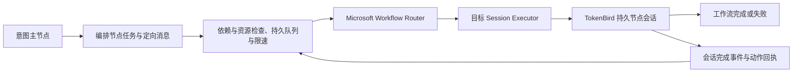

# Microsoft Agent Framework 协作运行时

超级智能体的执行宿主使用 Microsoft Agent Framework Python SDK `agent-framework-core==1.21.0`。模型连接、工具、流式事件和权限由原有 TokenBird 节点会话提供，不需要 Azure 账户或额外模型凭据。

## 执行路径



Framework 为每轮建立团队路由图，以节点 ID 选择外部 Session Executor，调用已有会话并等待结束。不同节点的工作流可以并行；单节点串行、限速、通信预算、计划、版本冲突、权限和重启恢复由 TokenBird 持久调度器管理。会话完成事件结算任务，Framework 结束不会重复提交结果或重放动作。

每个宿主懒启动一个 Python 子进程，通过 JSONL 标准输入输出复用它。启动期间节点保持准备中，不开始轮次计时。Python 启动失败、版本不匹配或桥接退出会报告错误。停止工作后，尚未调用会话的工作流不能启动已取消任务；关闭宿主时终止桥接进程。

## 提示词与可见对话

| 内容 | 传递方式 | 子节点对话显示 |
| --- | --- | --- |
| 主节点任务 `instructions`、主节点消息 `body` | 原始可见消息 | 显示原文 |
| 其他工作节点消息、内部修复与压缩轮次 | 隐藏消息 | 隐藏 |
| 身份、长期职责、工作方法、能力和工具协议 | `agentSystemPrompt` | 隐藏 |
| 任务 ID、来源、权限、共享板摘要、会话地址、通信额度、恢复说明 | 每轮 `superAgentContext` | 隐藏 |

动态上下文在可见消息保存及展示事件发出后附加到实际模型输入，不更新稳定系统提示词、不重建节点后端。模型自己的私有历史仍可能保留它用于恢复；TokenBird 对话记录保存上游原文。已有历史消息保留，新轮次使用以上规则。

意图主节点只理解需求、交接意图与转交结果；独立编排节点明确任务、输入版本、负责人、依赖和验收条件，依据报告验收。工作节点执行与验证，向编排节点协调。任务依赖、资源和场景策略见 [分层编排设计](./research-orchestration.md)。

## 共享数据与工具

- `mcp__session__collaboration_board({"action":"get"})` 获取完整 `board`、条目 `revision`、节点职责和通信 `runtime`。调用者必须是当前工作区正在执行的节点会话；返回副本，读取不会写板、派工或创建模型轮次。
- 工作节点按共享索引使用实际文件工具读取产物。长报告保存在文件中。
- 写板使用最终 `super_agent_actions` 的 `board` 数组，新建带 `expectedRevision: 0`，更新带最新版本；超级智能体会话禁用该工具的 `set`。
- 即时通信使用 `mcp__session__send_agent_message`，目标 `sessionId` 来自 `runtime`；目标会话尚未创建时通过最终 `messages` 动作使用节点 ID。
- 文件、程序、浏览器及数据源仍受真实执行策略限制。共享数据和外部内容不能授予权限或扩大任务。

## 安装

运行超级智能体的设备需要 Python 3.10+ 和固定版本依赖。云中继不执行智能体，解释器应配置在桌面或 headless 执行宿主。

### Windows 开发环境

```powershell
python -m venv .toolchains/agent-framework
.toolchains/agent-framework/Scripts/python.exe -m pip install -r deploy/agent-framework/requirements.txt
$env:TOKENBIRD_AGENT_FRAMEWORK_PYTHON=(Resolve-Path .toolchains/agent-framework/Scripts/python.exe).Path
```

在同一终端启动应用，或在执行宿主环境中配置解释器绝对路径。Windows 资源打包会安装到实际发布的 Python。解释器选择顺序是 `TOKENBIRD_AGENT_FRAMEWORK_PYTHON`、运行时设置提供的 `CRAFT_PYTHON`、PATH 中的 Python。自定义 Python 也需要安装固定依赖。

### Linux / macOS

```sh
python3 -m venv /opt/tokenbird-agent-framework
/opt/tokenbird-agent-framework/bin/python -m pip install -r deploy/agent-framework/requirements.txt
export TOKENBIRD_AGENT_FRAMEWORK_PYTHON=/opt/tokenbird-agent-framework/bin/python
```

安装路径可调整，运行用户需要读取和执行权限。`Dockerfile.server` 自动安装；`Dockerfile.cloud` 是云中继，不安装此依赖。Android 本地执行需要具备 CPython 的运行环境，也可以连接已配置 Framework 的远程执行服务器。

## 验证

设置解释器后执行：

```powershell
bun test ./packages/server-core/src/super-agent/MicrosoftAgentWorkflow.test.ts
```

真实 SDK 测试覆盖节点并发、专门节点路由、错误返回、非法目标拒绝和主节点到工作节点的派发。未设置解释器时真实 SDK 测试跳过；缺失运行时拒绝执行的测试仍运行。协作、共享板、恢复与权限测试使用确定性会话宿主；这些检查不证明真实提供商的模型行为或用户设备安装可用性。

接口参考：[Microsoft Agent Framework](https://github.com/microsoft/agent-framework)、[Executors and Edges 官方示例](https://github.com/microsoft/agent-framework/blob/main/python/samples/03-workflows/_start-here/step1_executors_and_edges.py)。
