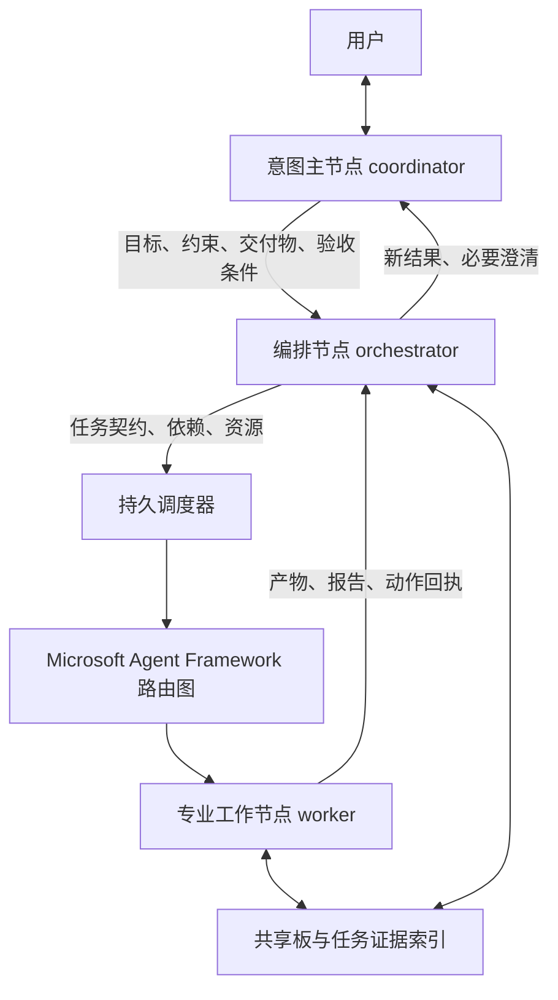

# 分层编排、协作基座与场景团队

本文对应 2026-10-09 源码。实现使用 Microsoft Agent Framework `agent-framework-core==1.21.0` 的 Workflow / Executor，复用 TokenBird 的模型连接、持久会话和工具。这里只说明已实现行为；构建检查不证明真实模型能稳定遵守所有协作要求。

## 1. 文献核实与可用结论

核实使用 Crossref DOI 元数据与 OpenAlex 收录摘要。没有取得下列论文的可读取全文；TechRxiv PDF 返回 HTTP 403，因此不把摘要阅读写成全文研究。

| 用户给出的论文 | 本次核实结果 | 用于设计的范围 |
| --- | --- | --- |
| Agentic AI in Action（IEEE，2026） | 找到 *Agentic AI in Action: A Review of Architectures, Communication, and Coordination in Intelligent Multi-Agent Systems*，DOI [10.1109/NKCon66957.2025.11345772](https://doi.org/10.1109/NKCon66957.2025.11345772)。Crossref 为 2025-09-27 的 NKCon 会议记录。没有可读摘要/全文 | 仅确认近似题名和元数据；不能核实“十余框架、2023–2025、三维分类法”等具体描述 |
| Multi-Agent Workflow Automation: Methods, Taxonomies, and Future Directions（HKUST，2025） | Crossref / OpenAlex 未定位到同名记录 | “22 篇文献”等暂不作为已确认事实；自适应编排是本产品的设计方向 |
| Internet of Agents（IEEE，2025） | 找到 *Internet of Agents: Fundamentals, Applications, and Challenges*，DOI [10.1109/TCCN.2025.3623369](https://doi.org/10.1109/TCCN.2025.3623369)。OpenAlex 年份 2025，Crossref 卷期记录年份 2026 | 收录摘要明确涉及异构互联、动态发现、能力通告、任务匹配、冲突解决。当前实现采用工作区内节点注册与身份校验，不宣称实现跨平台智能体互联网 |
| LLM-Powered Multi-Agent Systems: A Survey of Collaboration and Learning Strategies（ACM，2026） | 未定位到该完整题名的匹配记录 | 不据此声称已实现协作学习、MARL 或经论文验证的性能收益 |
| Orchestrating Autonomy: Patterns, Protocols, and Governance for Enterprise Agentic AI（TechRxiv，2025） | Crossref 匹配 DOI [10.36227/techrxiv.176238026.60445463/v1](https://doi.org/10.36227/techrxiv.176238026.60445463/v1)，2025-11-05；OpenAlex 有摘要。TechRxiv 是预印本来源 | 摘要中的层级团队、规划/工具/共享记忆原语、可观测性、监督、基准与可复现性，映射到以下实现；不将其称为已同行评审证据 |

元数据与摘要查询可复核：[Crossref API](https://api.crossref.org/works/10.1109%2FTCCN.2025.3623369)、[OpenAlex 论文检索](https://api.openalex.org/works?search=Orchestrating%20Autonomy)。未找到匹配不等于论文不存在；取得 DOI 或 PDF 后可继续逐项核实。

设计采用上述已能核实的摘要方向，并结合本仓库的执行边界。三层分工、依赖协议和场景参数是 TokenBird 的工程设计，不是对某篇论文分类法或算法的复现。

## 2. 三层职责

| 角色 | 负责 | 宿主强制边界 |
| --- | --- | --- |
| 意图主节点 | 理解需求、必要澄清、交接意图、转交结果 | 不能派 tasks / 改 plans / 写 board；只能通过 intent 或定向消息交给编排节点；只有它可提交 userReply |
| 编排节点 | 拆解计划、领域节点选择、依赖与资源协调、失败后的调整、依据报告验收 | 不能直接回复用户、执行文件/程序/浏览器或派生新模型；可提交 tasks / plans / board / acceptances / messages |
| 工作节点 | 完成被分配的专业目标、实际工具操作、产物与验证报告 | 不能派任务、维护计划、提交 intent / acceptances / userReply；执行受真实权限策略控制 |

每节点仍是一个持久模型会话，轮次串行。新团队恰好一个意图主节点、一个编排节点，至少一个工作节点。生产宿主开启自动升级：旧团队彻底空闲后新增编排节点，沿用主节点可用的连接与模型；保留原 ID、资源绑定、权限和会话。排队、执行、恢复及未解决脚本期间延迟升级，避免重分类在途工作。达到 32 个节点时提示释放一个位置，不丢弃节点。旧存档校验仍兼容两层团队，确定性旧协议测试也保留兼容路径。

## 3. 隐藏指令与可见对话

- 节点身份、长期分工、工具协议和当前团队状态通过系统提示词与隐藏上下文注入。
- 工作节点只显示编排节点传入的任务正文或定向消息，不添加标题、身份或全队 JSON。编排节点显示意图主节点传入的交接内容。
- 结果汇总、同级讨论、恢复提示、巡检和压缩指令隐藏。主节点只显示用户输入；内部返回隐藏，最终对用户的答复由 userReply 选定。
- 不删除历史可见消息。隐藏是显示与持久消息属性，不是模型隔离或保密技术；模型仍接收这些指令。

## 4. 协作基座

### 意图记录

主节点通过 `intent: { goal, constraints: [], deliverables: [], acceptanceCriteria: [] }` 交接。宿主生成 ID、来源轮次与时间，持久保存至 `state.intents`，并唤醒编排节点。状态询问不应重新下达原目标；目标变化交编排节点核对既有计划与用户授权。

### 任务依赖与资源

任务支持稳定 `id`、`planId`、`dependsOn`、`resources`、`acceptanceCriteria`、`requiresIndependentReview`、`reviewOf`。一个动作块按拓扑顺序创建任务；依赖必须引用已存在任务，不能引用自己或未来任务，因此新增任务无法形成环。重复任务 ID 被拒绝，动作回执保留实际应用结果。

普通依赖等待前置完成；前置有验收条件或独立复核要求时还必须 accepted。失败、取消、动作拒绝或验收拒绝不会释放普通下游。编排节点根据证据安排新恢复任务，不自动重跑未知外部副作用。

独立复核使用 `reviewOf` 指向产出任务，并将其列入 `dependsOn`。复核节点必须不同于执行者，可以在产物提交后读取验证，避免“先验收才能复核”的死锁。

`resources` 是任务声明的独占写入资源，路径大小写保守折叠、分隔符统一，同一路径及父/子路径互斥。从准备阶段开始占用，执行、恢复及关联的运行/未知脚本期间保持；脚本可能继续写入时不会提前释放。资源要求规范路径，不接受 `..`。这是协作调度约束，不是文件系统锁、跨工作区分布式锁或自动识别全部工具写入；编排节点必须完整声明真实修改范围。

`workflow.maxParallelTasks` 限制同时准备、执行或恢复的任务数；节点限速、通信链深度 6 / 总轮次 32、持久排队与执行权限仍同时生效。

### 验收证据

模型正常完成只使任务 `status=completed`（提交结果）。编排节点通过 `acceptances: [{ taskId, evidenceTaskId, status: 'accepted'|'rejected', note }]` 记录验收。证据任务必须实际完成、有报告且动作回执无拒绝；独立复核要求另一个工作节点的对应 reviewOf 任务。开启场景独立复核策略后，所有非 reviewOf 任务必须声明非空 acceptanceCriteria，并由另一个工作节点复核；遗漏字段或设置 false 都不能绕过。团队至少需要两个工作节点。

现代计划 completed 必须有任务，所有关联任务完成并 accepted，关联脚本的终态已处理。验收通过且下游已经派发后，不能改写旧验收；新版本用新任务。任务页面区分“已提交，待验收 / 已验收 / 验收未通过”，显示前置任务与验收说明。

宿主校验证据引用、状态和角色关系，不能自动证明报告真实或版本未变。源文件、哈希、来源、命令与覆盖范围由工作节点核实并写入报告/共享板；当前没有通用不可变产物仓库或自动失效传播。

### 共享查询与审计

`mcp__session__collaboration_board({ action: 'get' })` 返回完整共享板与 revision、节点目录和会话地址。现代团队另返回 `coordination`：编排节点读取完整任务契约/报告与计划，工作节点只读取当前任务及直接依赖的记录；不返回提供商配置、密钥或完整聊天历史。该接口仅供当前工作区正在执行的真实节点调用。

写入通过最终 board 动作使用 expectedRevision；直接 set 禁用。消息使用真实节点 ID 或 runtime.sessionId。意图主节点的即时通信工具同样禁止绕过编排直接派给工作节点。所有控制动作仍有 applied / rejected / notAttempted 回执。

## 5. 场景团队

所有模板共用三层基础，执行图由编排节点针对具体需求实例化；不是每次唤醒全部节点。

| 场景 | 任务图 | 团队 | 并发任务上限 | 交付验收 | 默认持续工作 |
| --- | --- | --- | --- | --- | --- |
| 日常 | 短流程，执行者自检，必要时整理与辅助核对 | 意图 + 日常编排 + 日常执行 + 整理 + 辅助，5 节点 | 2 | 按风险选择复核 | 开启 |
| 代码 | 接口/开发 → 独立测试与审查 → 验收 | 意图 + 工程编排 + 开发 + 测试 + 审查 + 代码辅助 + 检查执行，7 节点 | 3 | 产出必须声明验收契约并独立复核 | 开启 |
| 科研 | 并行文献/数据准备 → 冻结输入实验 → 方法与结论复核 | 意图 + 科研编排 + 文献 + 实验 + 方法复核 + 整理 + 辅助，7 节点 | 4 | 产出必须声明验收契约并独立复核 | 开启 |
| 工作交付 | 输入整理 → 并行分析/制作 → 质检与汇总 | 意图 + 交付编排 + 分析 + 制作 + 质检 + 整理 + 辅助，7 节点 | 3 | 默认允许执行者自检，重要交付显式独立复核 | 开启 |
| 故障运维 | 证据诊断 → 授权修复 → 原路径恢复验证 | 意图 + 故障编排 + 诊断 + 修复 + 恢复验证 + 整理 + 辅助，7 节点 | 2 | 产出必须声明验收契约并独立复核 | 关闭 |

模型仅在用户已登录的连接和当前分组内选择。型号名称与人工评级不是实际能力、价格或性能测评。应用模板按稳定职责标识复用工作节点 ID；保留匹配职责的资源绑定，以及不匹配但仍有资源或自定义能力标签的旧专业节点。意图与编排保留交接身份；环境与权限保持用户配置。任务级思考强度、执行条件检查与运行统计见使用说明。

## 6. 验证与剩余边界

确定性测试覆盖三层交接、禁止越权派工、对话可见性、独立复核、依赖释放、资源串行与独立并行、失败与重启、不重复稳定任务、计划验收、场景并发与复核策略、迁移。真实 SDK 测试使用发布资源内 Python 验证三角色 Workflow 路由、并发、错误传播与非法执行目标拒绝。

未来仍需真实模型的场景评测，记录目标达成率、重复工作率、证据覆盖、恢复成功率、耗时、模型轮次及工具成本。当前没有新的在线学习、跨平台动态发现、自动费用预算、全局资源锁或模型报告真实性证明；不以功能测试声称这些能力或论文级基准收益。
